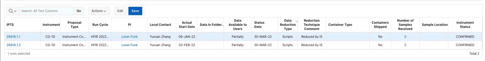

[HOME](index.md)

# Availability of reduced data using a browser

1. Go to the **[http://ipts.ornl.gov](ipts.ornl.gov)** page

**Warning** Make sure you are logged in (top right corner)

2. Go to **Experiments > Experiment Tracking**

3. Access the IPTS entries

For this example, we will use ##IPTS-28918## at ##HFIR##.

 * enter the **IPTS number**
 * select **all proposal type** and move them to the right
 * select **CG1D**
 * hit **GO**
 

4. Time to edit the state of the **Data available to users**

Click the **Edit** button at the top of the table to enter *edit* mode. 

5. Save the changes by clicking the **Save** button.
