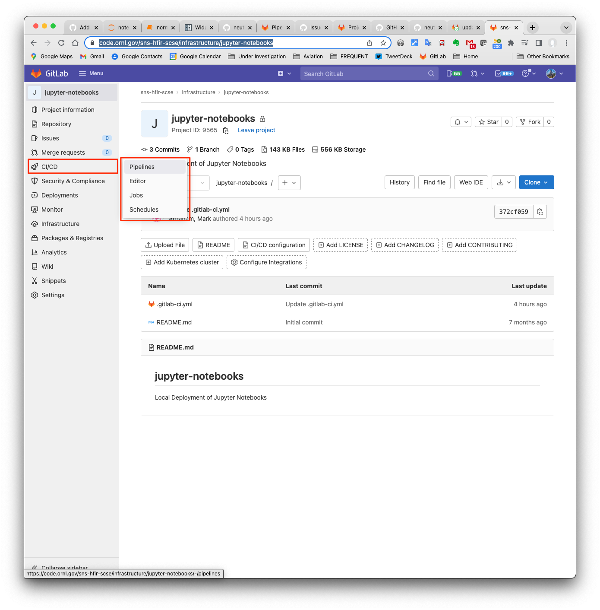
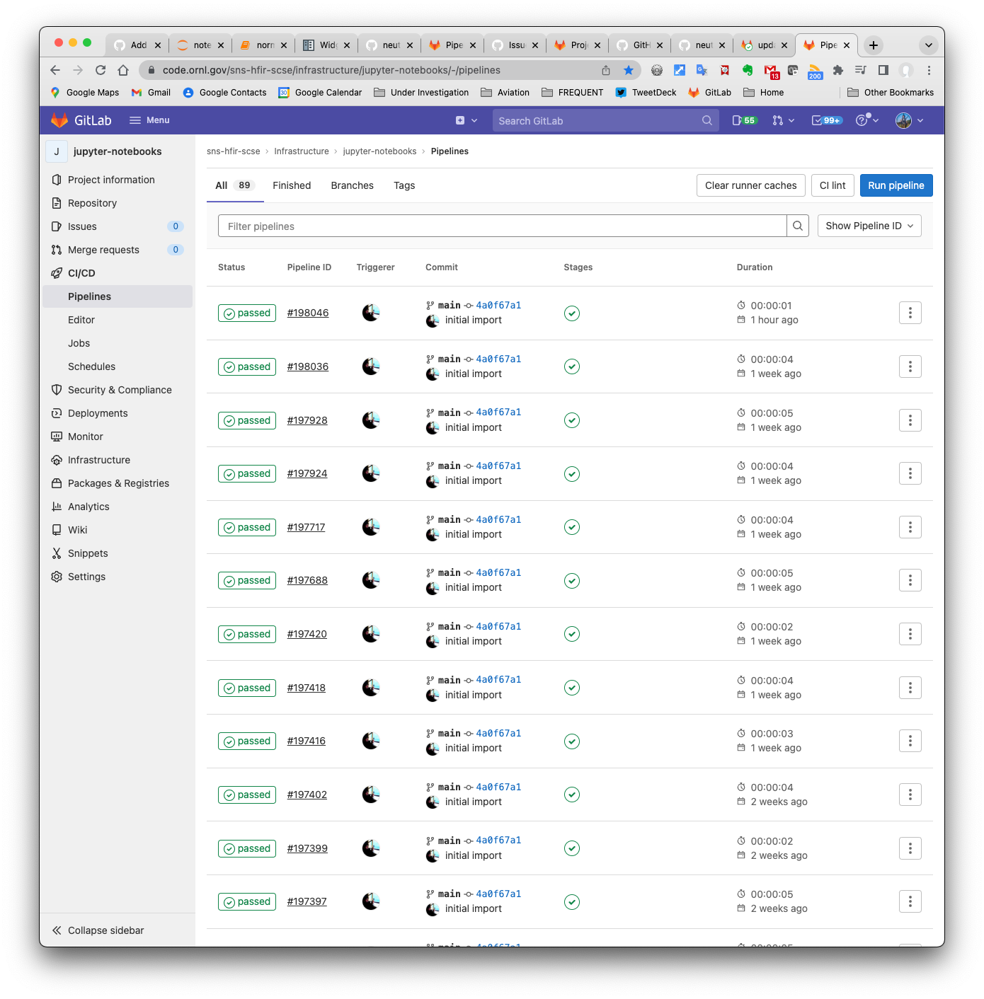

Once a push has been made to the [jupyter notebook repository](https://github.com/neutronimaging/python_notebooks) in the
master branch.  

Then the CI is accessible [here](https://code.ornl.gov/sns-hfir-scse/infrastructure/jupyter-notebooks).

